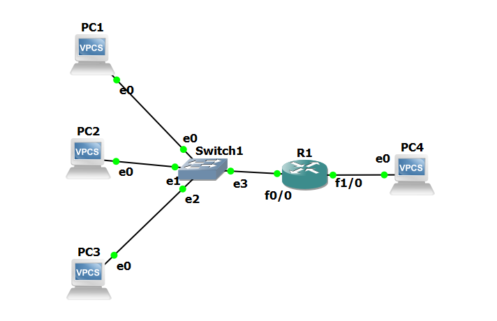

# NAT and DHCP on a Cisco Router (GNS3)

Static NAT, PAT, dynamic NAT and a DHCP server on one Cisco 7200, each verified with `show` commands and with packet captures on both sides of the router.

> Individual lab, built in GNS3 (Oct 2026). Router: Cisco 7200, IOS 15.2. Hosts: VPCS.

## Topology



| Device | Interface | Address | Role |
|---|---|---|---|
| R1 | FastEthernet0/0 | 192.168.10.1/24 | NAT inside, DHCP server |
| R1 | FastEthernet1/0 | 203.0.113.1/24 | NAT outside |
| PC1, PC2, PC3 | e0 | 192.168.10.2, .3, .4 (static), later .11+ (DHCP) | Inside hosts |
| PC4 | e0 | 203.0.113.3/24, **no default gateway** | Outside host |

PC4 has no gateway on purpose. It stands in for an Internet host, which has no route back to a private address. Without NAT, replies to the inside network cannot return.

## Results at a glance

| Step | Test | Result |
|---|---|---|
| Baseline | PC1 → PC4, no NAT | Fails. Requests reach PC4, no reply comes back. |
| Static NAT | PC1 → PC4 | Works. Source becomes 203.0.113.10. |
| Static NAT | PC2 → PC4 | Fails. PC2 has no mapping and leaves untranslated. |
| Static NAT | PC4 → 203.0.113.10 | Works and reaches PC1. Static NAT is two-way. |
| PAT | PC1 and PC2 → PC4 at the same time | Both work through one address, 203.0.113.1. |
| Dynamic NAT | PC1, PC2, PC3 → PC4 with a 2-address pool | PC1 and PC2 work. PC3 gets "Destination host unreachable". |
| DHCP | PC1, PC2, PC3 request addresses | They receive .11, .12, .13. Leases renew every ~62 s. |
| DHCP + PAT | PC1 (192.168.10.11 from DHCP) → PC4 | Works. Outside source is 203.0.113.1. |

## 1. Baseline: why NAT is needed

PC1 pings its gateway successfully but cannot ping PC4. The outside capture shows all five echo requests arriving at PC4 with source 192.168.10.2, and no replies.

The forward path is fine: both networks are directly connected to R1. The return path is the problem. PC4 sees a source address outside its own subnet and has no gateway to send the reply to.

Files: [`outputs/00_baseline.txt`](outputs/00_baseline.txt), [`pcaps/00_baseline_outside.pcapng`](pcaps/00_baseline_outside.pcapng)

## 2. Static NAT

```
ip nat inside source static 192.168.10.2 203.0.113.10
```

```
R1#show ip nat translations
Pro Inside global      Inside local       Outside local      Outside global
--- 203.0.113.10       192.168.10.2       ---                ---
```

PC4's configuration did not change. What changed is the source address it sees: 203.0.113.10 is in PC4's own subnet, so PC4 replies directly, and R1 translates the destination back to 192.168.10.2.

PC2 still fails. Its packets leave R1 with source 192.168.10.3, which puts it in the same position as the baseline.

**R1 answers ARP for the NAT address.** When PC4 pings 203.0.113.10, it first sends an ARP request for that address. R1 replies with its own MAC, although 203.0.113.10 is not configured on any interface. Without that reply PC4 could not build the frame.

Files: [`outputs/01_static_nat.txt`](outputs/01_static_nat.txt) (includes `debug ip nat`), [`pcaps/01_static_inside.pcapng`](pcaps/01_static_inside.pcapng), [`pcaps/01_static_outside.pcapng`](pcaps/01_static_outside.pcapng)

## 3. PAT (overload)

```
access-list 1 permit 192.168.10.0 0.0.0.255
ip nat inside source list 1 interface FastEthernet1/0 overload
```

PC1 and PC2 each sent 20 pings at the same time. All succeeded. The outside capture contains only one source address, 203.0.113.1.

**R1 rewrites colliding ICMP identifiers.** Both hosts happened to use the same ICMP IDs. R1 gave each one a unique ID on the outside:

| Host | Inside local | Inside global |
|---|---|---|
| PC1 | 192.168.10.2:1927 | 203.0.113.1:1027 |
| PC2 | 192.168.10.3:1927 | 203.0.113.1:1026 |

If R1 kept ID 1927 for both, a reply to 203.0.113.1 with ID 1927 would match two table entries and R1 could deliver it to only one host.

**UDP uses port numbers the same way:**

| Host | Inside local | Inside global |
|---|---|---|
| PC1 | 192.168.10.2:54057 | 203.0.113.1:4502 |
| PC2 | 192.168.10.3:23297 | 203.0.113.1:4501 |

The UDP test went to destination port 7, the VPCS default.

Files: [`configs/R1_pat.cfg`](configs/R1_pat.cfg), [`outputs/02_pat.txt`](outputs/02_pat.txt), [`pcaps/02_pat_inside.pcapng`](pcaps/02_pat_inside.pcapng), [`pcaps/02_pat_outside.pcapng`](pcaps/02_pat_outside.pcapng)

## 4. Dynamic NAT and pool exhaustion

```
ip nat pool PUBLIC 203.0.113.20 203.0.113.21 netmask 255.255.255.0
ip nat inside source list 1 pool PUBLIC
```

The pool has two addresses and there are three inside hosts.

| Order | Host | Result | Address used |
|---|---|---|---|
| 1 | PC1 | Works | 203.0.113.20 |
| 2 | PC2 | Works | 203.0.113.21 |
| 3 | PC3 | Destination host unreachable from 192.168.10.1 | none left |
| 4 | PC3, after `clear ip nat translation *` | Works | 203.0.113.20 |

Excerpt:

```
R1#show ip nat statistics
 pool PUBLIC: netmask 255.255.255.0
        start 203.0.113.20 end 203.0.113.21
        type generic, total addresses 2, allocated 2 (100%), misses 20
```

The captures agree: on the inside, R1 sends an ICMP unreachable to PC3 for every request. On the outside, nothing from PC3 appears.

**Timeout versus unreachable.** PC2 under static NAT timed out: its packet left the router and nobody answered. PC3 here got an explicit unreachable from R1: the router itself dropped the packet. An unreachable message names the device to check first.

In a real network the fix is to add `overload` to the pool, so each public address serves many hosts by port.

Files: [`configs/R1_dynamic_nat.cfg`](configs/R1_dynamic_nat.cfg), [`outputs/03_dynamic_nat.txt`](outputs/03_dynamic_nat.txt), [`pcaps/03_dynamic_inside.pcapng`](pcaps/03_dynamic_inside.pcapng), [`pcaps/03_dynamic_outside.pcapng`](pcaps/03_dynamic_outside.pcapng)

## 5. DHCP server

```
ip dhcp excluded-address 192.168.10.1 192.168.10.10
ip dhcp pool LAN_POOL
 network 192.168.10.0 255.255.255.0
 default-router 192.168.10.1
 lease 0 0 2
```

Excerpt:

```
R1#show ip dhcp binding
192.168.10.11   0100.5079.6668.00       Oct 02 2026 11:29 AM    Automatic  Active     FastEthernet0/0
192.168.10.12   0100.5079.6668.01       Oct 02 2026 11:29 AM    Automatic  Active     FastEthernet0/0
192.168.10.13   0100.5079.6668.02       Oct 02 2026 11:29 AM    Automatic  Active     FastEthernet0/0
```

The first address handed out is .11 because .1 to .10 are excluded. The address on each host, the router's binding table and the capture all match.

**DORA in the capture (PC1):**

| Message | Source → Destination |
|---|---|
| Discover | 0.0.0.0 → 255.255.255.255 |
| Offer | 192.168.10.1 → 192.168.10.11 |
| Request | 0.0.0.0 → 255.255.255.255 |
| ACK | 192.168.10.1 → 192.168.10.11 |

The client sends from 0.0.0.0 because it has no address yet, and to broadcast because it does not know where the server is.

**Other observations from the capture:**

- The lease is 120 s with renewal time (T1) 60 s and rebinding time (T2) 105 s. Every host renews about every 62 s, at T1.
- R1 sends an ARP request for the address before offering it, and the Offer follows about 2 s after the first Discover. The client sends a second Discover while it waits.
- After the ACK, each client sends three ARP requests for its own new address.
- `ip dhcp -x` on PC3 sends a DHCP Release, and PC3's entry disappears from the binding table.
- VPCS sends its renewal Requests as broadcasts from 0.0.0.0.

Files: [`outputs/04_dhcp.txt`](outputs/04_dhcp.txt), [`pcaps/04_dhcp_inside.pcapng`](pcaps/04_dhcp_inside.pcapng)

## 6. Final configuration: DHCP + PAT

The final configuration combines both: inside hosts get their address from DHCP and reach the outside through one public address.

```
icmp 203.0.113.1:1024  192.168.10.11:28055 203.0.113.3:28055 203.0.113.3:1024
```

Files: [`configs/R1_final_dhcp_pat.cfg`](configs/R1_final_dhcp_pat.cfg), [`outputs/05_dhcp_with_pat.txt`](outputs/05_dhcp_with_pat.txt), [`pcaps/05_dhcp_pat_inside.pcapng`](pcaps/05_dhcp_pat_inside.pcapng), [`pcaps/05_dhcp_pat_outside.pcapng`](pcaps/05_dhcp_pat_outside.pcapng)

## Problems I ran into

**VPCS read the subnet mask as a gateway.** I set PC4 with `ip 203.0.113.3 255.255.255.0`, and VPCS stored 255.255.255.0 as the default gateway. The first baseline capture showed PC4 sending ARP requests for 255.255.255.0. I fixed it with `ip 203.0.113.3/24` and confirmed with `show ip` that the gateway was 0.0.0.0. I now run `show ip` after every address change.

**Interface names differed from my plan.** The 7200 has no FastEthernet0/1. The port adapter in slot 1 is FastEthernet1/0. `show ip interface brief` gave the real names.

**VPCS ping options are case-sensitive.** `-P` selects the protocol and `-p` the destination port. My first UDP attempt used `-p 17` and still sent ICMP, which I noticed because the output said `icmp_seq`.

## Repository layout

```
nat-dhcp/
  topology.png
  nat-dhcp.gns3        GNS3 project file (no IOS image included)
  configs/             show running-config at each stage
  outputs/             ping results and show/debug output, in test order
  pcaps/               captures on the inside and outside links
```

No full running-config was captured for the static NAT stage. [`configs/static_nat_commands.txt`](configs/static_nat_commands.txt) lists the command added on top of the base config.
