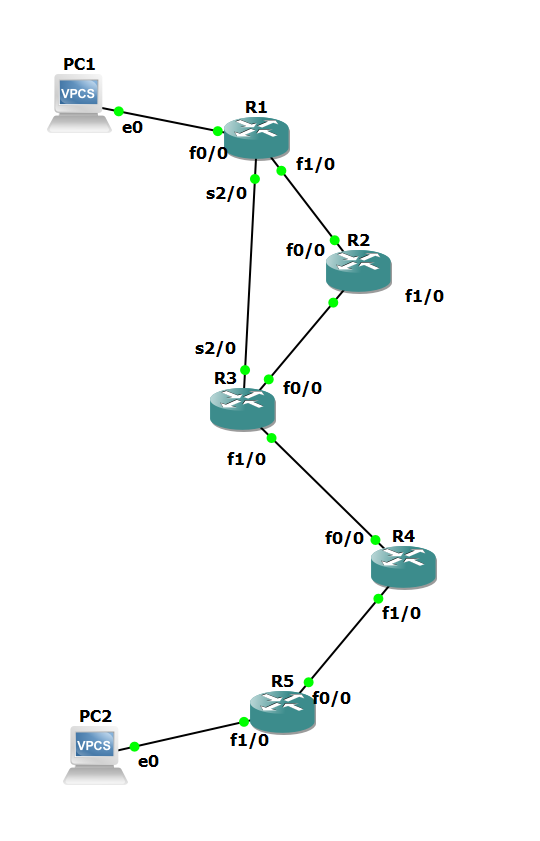
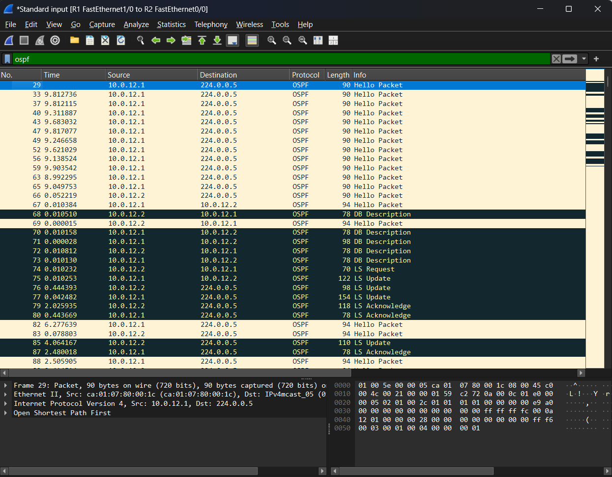

# OSPF: Single Area, Link Failure, Multi-Area and Virtual Link (GNS3)

Five Cisco 7200 routers running OSPF. The lab measures how long traffic is down after three kinds of link failure, then splits the network into areas in a way that breaks it and repairs it with a virtual link. Every result is backed by `show` output and packet captures.

> Individual lab, built in GNS3 (Oct 2026). Routers: Cisco 7200, IOS 15.2. Hosts: VPCS.

## Topology



| Link | Network | Addresses | OSPF cost | Area (parts 4 and 5) |
|---|---|---|---|---|
| PC1 – R1 f0/0 | 192.168.1.0/24 | PC1 .10, R1 .1 | 1 | 0 |
| R1 f1/0 – R2 f0/0 | 10.0.12.0/30 | R1 .1, R2 .2 | 1 | 0 |
| R2 f1/0 – R3 f0/0 | 10.0.23.0/30 | R2 .1, R3 .2 | 1 | 0 |
| R1 s2/0 – R3 s2/0 | 10.0.13.0/30 | R1 .1, R3 .2 | 64 | 0 |
| R3 f1/0 – R4 f0/0 | 10.1.34.0/30 | R3 .1, R4 .2 | 1 | 1 |
| R4 f1/0 – R5 f0/0 | 10.2.45.0/30 | R4 .1, R5 .2 | 1 | 2 |
| R5 f1/0 – PC2 | 192.168.5.0/24 | R5 .1, PC2 .10 | 1 | 2 |

Router IDs are 1.1.1.1 to 5.5.5.5. The serial link between R1 and R3 is a backup path: it is shorter in hops but has cost 64.

## Results at a glance

| Part | Test | Result |
|---|---|---|
| 1 | PC1 → PC2 before OSPF | Destination host unreachable from R1. |
| 2 | Single-area OSPF | PC1 → PC2 works through R2 with cost 5. The serial path (cost 67) is not used. |
| 3a | `shutdown` on R1 f1/0 | Traffic down for 7.06 s, 3 pings lost. |
| 3b | Link suspended, interfaces stay up | Traffic down for 41.08 s, 20 pings lost. |
| 3c | Same failure with Hello 1 s, Dead 4 s | Traffic down for 11.06 s, 5 pings lost. |
| 4 | Areas 0, 1 and 2 in a chain | All neighbors FULL, but PC1 cannot reach PC2. Area 2 is cut off. |
| 5 | Virtual link R3–R4 through area 1 | PC1 → PC2 works again. R4 becomes an area border router. |

## 1. Baseline

All interfaces are up and R1 can ping both of its neighbors. PC1 cannot reach PC2, and the reply comes from its own gateway:

```
PC1> ping 192.168.5.10
*192.168.1.1 icmp_seq=1 ttl=255 time=9.316 ms (ICMP type:3, code:1, Destination host unreachable)
```

R1 has no route to 192.168.5.0/24, so it drops the packet and says so. This is different from a timeout, where the packet leaves and nothing comes back.

Files: [`outputs/00_base.txt`](outputs/00_base.txt)

## 2. Single-area OSPF

All networks are in area 0. The two LAN interfaces are passive.

Excerpts:

```
R1#show ip ospf neighbor
Neighbor ID     Pri   State           Dead Time   Address         Interface
3.3.3.3           0   FULL/  -        00:00:34    10.0.13.2       Serial2/0
2.2.2.2           1   FULL/BDR        00:00:39    10.0.12.2       FastEthernet1/0

R1#show ip route ospf
O        10.0.23.0/30 [110/2] via 10.0.12.2, 00:11:55, FastEthernet1/0
O        10.1.34.0/30 [110/3] via 10.0.12.2, 00:10:24, FastEthernet1/0
O        10.2.45.0/30 [110/4] via 10.0.12.2, 00:09:28, FastEthernet1/0
O     192.168.5.0/24 [110/5] via 10.0.12.2, 00:08:31, FastEthernet1/0
```

**Path selection follows cost, not hop count.** To reach 192.168.5.0/24, the path through R2 crosses five FastEthernet links: 1 + 1 + 1 + 1 + 1 = 5. The path over the serial link has one router fewer but costs 64 + 1 + 1 + 1 = 67. OSPF installs the cost-5 path, and `trace` from PC1 confirms it (R1, R2, R3, R4, R5).

**Every router in the area holds the same database.** `show ip ospf database` on R1 and on R3 lists the same 5 Router LSAs and 4 Network LSAs with identical sequence numbers and checksums.

**No DR on the serial link.** The serial neighbor shows `FULL/ -`. A point-to-point link has only two routers, so no DR is elected. Each Ethernet link elects one and produces one Network LSA.

### Adjacency in the capture



Captured on the R1–R2 link while OSPF was being enabled:

| Time | Event |
|---|---|
| 0 s | R1 sends its first Hello. The DR field is 0.0.0.0. |
| +48 s | The Wait timer (40 s) has expired with no other router on the link. R1's next Hello names itself as DR. |
| +104.4 s | R2 sends its first Hello. R1 answers at once with a unicast Hello. |
| +104.5 s | Database Description packets, then LS Request, then LS Update. The exchange takes about 0.07 s. |
| +107 s | LS Acknowledge from both routers. |

R1 became DR because it was alone on the link when the Wait timer ended, not because of its priority or router ID. R2 has the higher router ID and still became BDR.

**DR election is not preemptive.** I saw this twice:

- After `clear ip ospf process` on R2, R1 stayed DR on the R1–R2 link. On the R2–R3 link, R3 moved up from BDR to DR and R2 came back as BDR.
- After part 3a, where R1's interface went down and came back, R2 was the DR on the R1–R2 link and R1 was BDR.

A router that leaves and returns does not get its old role back.

Files: [`configs/1_single_area/`](configs/1_single_area/), [`outputs/01_single_area.txt`](outputs/01_single_area.txt), [`pcaps/01_adjacency_R1-R2.pcapng`](pcaps/01_adjacency_R1-R2.pcapng), [`pcaps/01_clear_process_R1-R2.pcapng`](pcaps/01_clear_process_R1-R2.pcapng)

## 3. Link failure and convergence

PC1 pings PC2 continuously while the R1–R2 link fails. I captured on the PC1 link and on the serial link at the same time. Downtime is the gap between the last echo reply before the failure and the first one after it.

| Case | How the link fails | Hello / Dead | Time to detect | Detect → traffic back | Downtime | Pings lost |
|---|---|---|---|---|---|---|
| 3a | `shutdown` on R1 f1/0 | 10 s / 40 s | 0.7 s | 6.3 s | **7.06 s** | 3 |
| 3b | Link suspended in GNS3 | 10 s / 40 s | 35.0 s | 6.1 s | **41.08 s** | 20 |
| 3c | Link suspended in GNS3 | 1 s / 4 s | 4.6 s | 6.5 s | **11.06 s** | 5 |

"Time to detect" ends when R1 floods its new Router LSA on the serial link. VPCS waits 2 s for each lost ping, so each figure is accurate to about 2 s.

In all three cases the route changed the same way:

```
R1#show ip route 192.168.5.0
  Known via "ospf 1", distance 110, metric 67, type intra area
  * 10.0.13.2, from 5.5.5.5, 00:01:25 ago, via Serial2/0
```

The metric went from 5 to 67, `trace` lost one router (R2), and the TTL of the replies rose from 59 to 60.

**3a: the router sees its own interface go down.** R1 logs `Neighbor Down: Interface down or detached` and floods a new LSA 0.7 s after the last reply. R3 acknowledges it 2.5 s later.

R2 is slower. Its interface is still up, so it has to wait for the Dead timer. Its new LSA reaches the serial link 39 s after R1's. Traffic does not wait for it: SPF uses a link only when both ends advertise it, and R1 has already withdrawn its end.

**3b: neither router sees the failure.** Suspending the link in GNS3 drops the packets but leaves both interfaces up, like a failure in a switch or provider network between two routers. R1 has to miss Hellos for the whole Dead interval and logs `Neighbor Down: Dead timer expired`. Detection took 35 s, not 40 s, because the timer had been running since the last Hello that arrived before the failure.

**3c: shorter timers shorten detection only.** With Hello 1 s and Dead 4 s on both ends of the link, detection dropped from 35.0 s to 4.6 s.

```
R1#show ip ospf interface f1/0
  Timer intervals configured, Hello 1, Dead 4, Wait 4, Retransmit 5
```

**About 6 s remain in every case.** After R1 floods the LSA, traffic still takes about 6 s to return, whatever the timers are. The cause is the SPF timer:

```
R1#show ip ospf | include SPF
 Initial SPF schedule delay 5000 msecs
```

The router waits 5 s after a topology change before it runs SPF. Hello and Dead timers do not affect this delay. Lowering it with `timers throttle spf` would be the next step. I did not test that here.

**Timers must match on both ends.** I first set Hello 1 s on R1 only. The adjacency with R2 went down although the link was healthy, and traffic moved to the serial path:

```
OSPF-1 HELLO Fa1/0: Mismatched hello parameters from 10.0.12.2
OSPF-1 HELLO Fa1/0: Dead R 40 C 4, Hello R 10 C 1 Mask R 255.255.255.252 C 255.255.255.252
```

`R` is the value received and `C` the value configured. The adjacency returned to FULL as soon as R2 got `ip ospf hello-interval 1`. IOS sets the Dead interval to four times the Hello interval by itself.

The R1–R2 link keeps Hello 1 s and Dead 4 s for the rest of the lab.

Files: [`outputs/02_failover_shutdown.txt`](outputs/02_failover_shutdown.txt), [`outputs/03_failover_silent.txt`](outputs/03_failover_silent.txt), [`outputs/04_failover_tuned_timers.txt`](outputs/04_failover_tuned_timers.txt) (contains `debug ip ospf hello` output), and two captures per case in [`pcaps/`](pcaps/): `*_pc1.pcapng` for the pings and `*_serial.pcapng` for the LSAs and the rerouted traffic.

## 4. Multi-area OSPF, broken on purpose

The R3–R4 link moves to area 1. The R4–R5 link and PC2's LAN move to area 2. Area 2 now touches area 1 but not area 0.

| Where | Before | After |
|---|---|---|
| R1 `show ip route ospf` | 4 routes, all `O` | 2 routes: 10.0.23.0 `O`, 10.1.34.0 `O IA` |
| R5 `show ip route ospf` | 5 routes | empty |
| R4 `show ip route ospf` | | 4 `O IA` routes from area 0 and `O` 192.168.5.0 |
| PC1 → PC2 | works | Destination host unreachable from R1 |

Every adjacency is FULL and every `network` statement is correct. The network is still broken.

**Why.** Routes between areas must pass through area 0. Only an area border router (ABR), which has an interface in area 0, creates Summary LSAs. R3 has interfaces in areas 0 and 1, and `show ip ospf` on R3 says `It is an area border router`. R4 has interfaces in areas 1 and 2 but none in area 0, so it is not an ABR and passes nothing between its two areas. R5 learns no outside routes, and area 2's networks are never advertised to the rest.

R4 itself reaches both sides, because it holds the databases of both areas.

A check of neighbor states would find nothing wrong here. The fault is in the area design.

Files: [`configs/2_multi_area/`](configs/2_multi_area/) (R3, R4 and R5; R1 and R2 did not change), [`outputs/05_before_areas.txt`](outputs/05_before_areas.txt), [`outputs/06_multi_area.txt`](outputs/06_multi_area.txt)

## 5. Virtual link

```
R3(config-router)#area 1 virtual-link 4.4.4.4
R4(config-router)#area 1 virtual-link 3.3.3.3
```

The command names the neighbor's router ID, not an interface address, and area 1 is the transit area.

Excerpts:

```
R3#show ip ospf virtual-links
Virtual Link OSPF_VL0 to router 4.4.4.4 is up
  Transit area 1, via interface FastEthernet1/0
    Adjacency State FULL (Hello suppressed)

R3#show ip ospf neighbor
Neighbor ID     Pri   State           Dead Time   Address         Interface
4.4.4.4           0   FULL/  -           -        10.1.34.2       OSPF_VL0
4.4.4.4           1   FULL/BDR        00:00:30    10.1.34.2       FastEthernet1/0
```

R3 now has two adjacencies with R4 over the same cable: the normal one in area 1 and the virtual one in area 0.

**R4 becomes an ABR.** The virtual link gives R4 an interface in area 0. `show ip ospf` on R4 now says `It is an area border router`, lists three areas, and marks area 1 with `This area has transit capability: Virtual Link Endpoint`. R4 starts to create Summary LSAs at once.

```
R1#show ip route ospf
O        10.0.23.0/30 [110/2] via 10.0.12.2, 01:03:46, FastEthernet1/0
O IA     10.1.34.0/30 [110/3] via 10.0.12.2, 00:43:49, FastEthernet1/0
O IA     10.2.45.0/30 [110/4] via 10.0.12.2, 00:04:25, FastEthernet1/0
O IA  192.168.5.0/24 [110/5] via 10.0.12.2, 00:04:25, FastEthernet1/0

R1#show ip ospf border-routers
i 4.4.4.4 [3] via 10.0.12.2, FastEthernet1/0, ABR, Area 0, SPF 29
i 3.3.3.3 [2] via 10.0.12.2, FastEthernet1/0, ABR, Area 0, SPF 29
```

R5 has five `O IA` routes, and PC1 reaches PC2 over the same path as in part 2. The cost to 192.168.5.0/24 is 5 again.

**The virtual link in the capture.** On the R3–R4 cable, two kinds of OSPF packets are visible:

| | Normal area 1 packets | Virtual link packets |
|---|---|---|
| Destination | 224.0.0.5 (multicast) | 10.1.34.1 or 10.1.34.2 (unicast) |
| Area ID in the OSPF header | 0.0.0.1 | 0.0.0.0 |
| IP TTL | 1 | 255 |

The virtual-link packets are unicast with TTL 255 because the two ends of a virtual link can be several routers apart.

LSAs learned over the virtual link are marked `(DNA)`, DoNotAge, in R1's database. The link runs as a demand circuit with Hellos suppressed, so these LSAs are not refreshed periodically and are not aged out.

A virtual link is a repair, not a design goal. The clean fix is to connect area 2 to area 0 directly.

Files: [`configs/3_virtual_link/`](configs/3_virtual_link/) (final configuration of all five routers), [`outputs/07_virtual_link.txt`](outputs/07_virtual_link.txt), [`pcaps/07_virtual_link_R3-R4.pcapng`](pcaps/07_virtual_link_R3-R4.pcapng)

## Problems I ran into

**Five routers used 100% CPU.** With all five 7200s running, the GNS3 VM sat at 100% CPU. Dynamips emulates the router CPU and keeps it busy even when IOS is idle. Setting an Idle-PC value for the routers brought the VM down to 1.6%.

**Old LSAs stayed in area 0 after the area change.** I expected R1 to hold 3 Router LSAs after R4 and R5 left area 0. It still had 5:

```
4.4.4.4         4.4.4.4         1090        0x80000009 0x0032F6 2
5.5.5.5         5.5.5.5         991         0x80000008 0x00FF0F 2
```

The area 0 adjacency between R3 and R4 ended when the link changed area, so R4 and R5 had no way to withdraw their old LSAs. The copies stay until they reach the maximum age of 3600 s. They do not affect routing:

```
R1#show ip ospf database router 5.5.5.5
  Adv Router is not-reachable in topology Base with MTID 0
```

In part 5, R5's stale LSA was still there at age 3406. The LSA count alone does not show the state of an area. The Age column and the reachability line do.

**A one-sided timer change took a healthy link down.** See part 3c. I now change Hello timers on both ends in one step and check `show ip ospf neighbor` right after.

**The DR was not where I expected.** After the failure tests, the DR on two links had changed. `show ip ospf neighbor` on the other router, or `show ip ospf interface`, shows the current DR. The original election cannot be assumed.

## Repository layout

```
ospf/
  topology.png
  adjacency_wireshark.png
  ospf.gns3            GNS3 project file (no IOS image included)
  configs/
    1_single_area/     R1 to R5
    2_multi_area/      R3, R4, R5
    3_virtual_link/    R1 to R5, final state
  outputs/             ping, trace, show and debug output, in test order
  pcaps/               captures, numbered like the outputs
```
