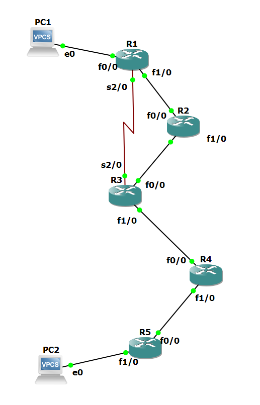
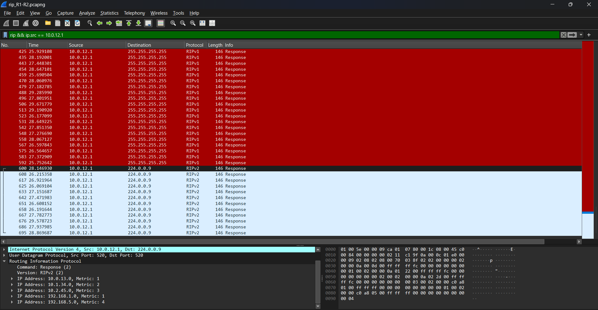

# RIP: Hop Count, Slow Convergence, Routing Loop and Count-to-Infinity (GNS3)

RIP on the same five routers and the same addressing as my [OSPF lab](../ospf/). The same link fails in the same three ways, so the two protocols can be compared directly. The last part builds a real routing loop and captures RIP counting to infinity.

> Individual lab, built in GNS3 (Oct 2026). Routers: Cisco 7200, IOS 15.2. Hosts: VPCS.

## Topology



| Link | Network | Addresses | Speed |
|---|---|---|---|
| PC1 – R1 f0/0 | 192.168.1.0/24 | PC1 .10, R1 .1 | 100 Mbps |
| R1 f1/0 – R2 f0/0 | 10.0.12.0/30 | R1 .1, R2 .2 | 100 Mbps |
| R2 f1/0 – R3 f0/0 | 10.0.23.0/30 | R2 .1, R3 .2 | 100 Mbps |
| R1 s2/0 – R3 s2/0 | 10.0.13.0/30 | R1 .1, R3 .2 | 1.544 Mbps |
| R3 f1/0 – R4 f0/0 | 10.1.34.0/30 | R3 .1, R4 .2 | 100 Mbps |
| R4 f1/0 – R5 f0/0 | 10.2.45.0/30 | R4 .1, R5 .2 | 100 Mbps |
| R5 f1/0 – PC2 | 192.168.5.0/24 | R5 .1, PC2 .10 | 100 Mbps |

## Results at a glance

| Part | Test | Result |
|---|---|---|
| 1 | RIPv1, then RIPv2 | PC1 → PC2 works. RIP sends it over the 1.544 Mbps serial link because that path has one hop fewer. |
| 2 | `offset-list` on the serial link | Traffic moves to the FastEthernet path, like OSPF chose by itself. |
| 3 | R1–R2 link fails | RIP is down for 199 s to 232 s. OSPF needed 7 s to 41 s for the same failures. |
| 4b | Split horizon off, RIPv2 | No routing loop. The RIPv2 Next Hop field stops it. |
| 4c | Split horizon off, RIPv1 | Routing loop within 5.5 s. Each ping crosses the same link 60 times. |
| 5 | Count-to-infinity | R4 and R5 raise the metric from 3 to 16 in 13 steps over 26.2 s. |

### RIP against OSPF, same topology, same failures

| Failure of the R1–R2 link | OSPF | RIP |
|---|---|---|
| `shutdown` on R1 | 7.06 s | 199.25 s |
| Link suspended, interfaces stay up, default timers | 41.08 s | 232.30 s |
| Link suspended, tuned timers | 11.06 s (Hello 1 s, Dead 4 s) | 32.08 s (`timers basic 5 15 15 30`) |

Downtime is the gap between the last echo reply before the failure and the first one after it, measured in a capture on the PC1 link.

## 1. RIPv1 and RIPv2

```
router rip
 network 10.0.0.0
 network 192.168.1.0        (R1; R5 uses 192.168.5.0)
 passive-interface FastEthernet0/0
```

Excerpt:

```
R1#show ip route rip
R        10.0.23.0/30 [120/1] via 10.0.13.2, 00:00:24, Serial2/0
                      [120/1] via 10.0.12.2, 00:00:19, FastEthernet1/0
R        10.1.34.0/30 [120/1] via 10.0.13.2, 00:00:24, Serial2/0
R        10.2.45.0/30 [120/2] via 10.0.13.2, 00:00:24, Serial2/0
R     192.168.5.0/24 [120/3] via 10.0.13.2, 00:00:24, Serial2/0
```

**RIP picks the slow link.** From R1, PC2's network is 3 hops away over the serial link and 4 hops away through R2. RIP installs the 3-hop path, and `trace` from PC1 shows 5 lines through 10.0.13.2. OSPF on the same routers chose the path through R2 (cost 5 against 67), because it knows the serial link is about 65 times slower.

**Equal hop counts give two paths.** 10.0.23.0/30 is one hop away through R2 and one hop away through R3, so R1 installs both next hops.

**What changes with version 2** (`version 2`, `no auto-summary`):

| | RIPv1 | RIPv2 |
|---|---|---|
| `show ip protocols` | send version 1, receive any version | send version 2, receive version 2 |
| Update destination | 255.255.255.255 | 224.0.0.9 |
| Entry in `debug ip rip` | `subnet 10.0.13.0 metric 1` | `10.0.13.0/30 via 0.0.0.0, metric 1, tag 0` |
| Netmask field in the capture | 0.0.0.0 | 255.255.255.252 |
| Transport | UDP 520 → 520 | UDP 520 → 520 |

RIPv1 still worked here because every subnet of 10.0.0.0/8 uses the same /30 mask. I changed the routers to version 2 one by one and no route was lost.



**Updates are not exactly 30 s apart.** Measured per router in the capture: 25.5 s to 30.2 s for RIPv1 (average 27.6 s) and 26.1 s to 29.6 s for RIPv2 (average 27.4 s). IOS shortens the interval by a random amount so that routers do not send at the same moment.

**Split horizon is already visible here.** R1 advertises 2 routes on the serial link and 5 routes on FastEthernet1/0. The routes it learned over the serial link are not sent back out of it.

### Good news travels fast, bad news travels slowly

I removed RIP from R5 with `no router rip` and added it again. Times are from the capture on the R1–R2 link.

| Time | Event |
|---|---|
| 756.86 s | R1 and R2 advertise 192.168.5.0 with metric 16 |
| 832 s to 838 s | 192.168.5.0 disappears from the updates |
| 896.54 s | RIP is back on R5. R2 and R1 advertise 192.168.5.0 again, 0.04 s apart |

`no router rip` sends nothing. R4 has to miss R5's updates for the 180 s Invalid timer before it declares the route dead. The way back was too fast for me to time by hand: a router sends a flash update as soon as its table changes, without waiting for the 30 s cycle. In the capture a flash update is easy to spot. It carries one route and arrives outside the cycle.

Files: [`configs/1_ripv2/`](configs/1_ripv2/), [`outputs/00_base.txt`](outputs/00_base.txt), [`outputs/01_ripv1.txt`](outputs/01_ripv1.txt), [`outputs/02_ripv2.txt`](outputs/02_ripv2.txt), [`pcaps/01_ripv1_ripv2_R1-R2.pcapng`](pcaps/01_ripv1_ripv2_R1-R2.pcapng)

## 2. Making RIP avoid the slow link

```
R1#show int s2/0 | include BW
  MTU 1500 bytes, BW 1544 Kbit/sec, DLY 20000 usec,
R1#show int f1/0 | include BW
  MTU 1500 bytes, BW 100000 Kbit/sec, DLY 100 usec,
```

RIP does not look at these values. To move traffic off the serial link I added 2 to the metric of every route learned over it, on both ends:

```
router rip
 offset-list 0 in 2 Serial2/0
```

| | Before | After |
|---|---|---|
| R1 → 192.168.5.0/24 | metric 3 via 10.0.13.2, Serial2/0 | metric 4 via 10.0.12.2, FastEthernet1/0 |
| R3 → 192.168.1.0/24 | metric 1 via 10.0.13.1, Serial2/0 | metric 2 via 10.0.23.1, FastEthernet0/0 |
| R1 → 10.0.23.0/30 | two next hops | via 10.0.12.2 only |
| `trace` PC1 → PC2 | 5 lines, over the serial link | 6 lines, through R2 |

The offset has to be 2. The serial path costs 3 hops and the path through R2 costs 4, so an offset of 1 would only make them equal. It also has to be on both routers, or the two directions take different paths.

The serial link is now a backup, as in the OSPF lab. OSPF reached this state from the interface bandwidth alone. With RIP I had to work out the metric of every path by hand.

Files: [`configs/2_offset_list/`](configs/2_offset_list/), [`outputs/03_offset_list.txt`](outputs/03_offset_list.txt)

## 3. Link failure

PC1 pings PC2 continuously while the R1–R2 link fails. Captures run on the PC1 link and on the serial link.

### 3a. `shutdown` on R1 FastEthernet1/0: 199.25 s

101 pings lost: 4 answered by R1 with "Destination host unreachable", then 97 timeouts.

| Time after shutdown | Event | Evidence |
|---|---|---|
| 0 s | R1 deletes every route through R2 | `RT: del 192.168.5.0 via 10.0.12.2, rip metric [120/4]` |
| 2 s | R1 advertises those routes with metric 16 on the serial link | serial capture |
| 4.5 s | R1 learns the serial path from R3's next periodic update | `RT: add 192.168.5.0/24 via 10.0.13.2, rip metric [120/5]` |
| 4.5 s to 199 s | 97 echo requests cross the serial link. No reply comes back. | serial capture |
| about 181 s | R2 gives up its route to 192.168.1.0 | `RT: no routes to 192.168.1.0, entering holddown` |
| about 193 s | R3 learns 192.168.1.0 over the serial link | `RT: add 192.168.1.0/24 via 10.0.13.1, rip metric [120/3]` |
| 199 s | First echo reply | PC1 capture |

**The forward path recovered in 4.5 s. The return path took over 3 minutes.** The `shutdown` was on R1. R2's interface stayed up, and RIP has no Hello, so R2 had no way to notice. For the 180 s Invalid timer R2 kept a normal route to PC1's network through the dead link and kept advertising it to R3:

```
R2#show ip route 192.168.1.0
  Known via "rip", distance 120, metric 1
  Last update from 10.0.12.1 on FastEthernet0/0, 00:02:45 ago
```

R3 trusted R2 (metric 2) over the serial path (metric 3), so replies from PC2 went to R2 and were lost there.

**Why OSPF needed 7 s.** R1's new LSA said "I have no link to R2". Every router dropped that link at once, because OSPF uses a link only when both ends advertise it. RIP can only say "I cannot reach these networks". It cannot tell R3 that R2's route is stale.

R1's own recovery in 4.5 s was partly luck. RIP keeps only the best route, so R1 had no backup stored and waited for R3's next periodic update, which can take up to 30 s.

### 3b. Link suspended, interfaces stay up: 232.30 s

115 pings lost, all timeouts. Times are from the serial capture. The link was suspended at about 9 s.

| Time | Event |
|---|---|
| 176.86 s | R3 advertises 192.168.1.0 with metric 16. R2's Invalid timer has expired. |
| 181.89 s | R1 advertises 10.0.23.0, 10.1.34.0, 10.2.45.0 and 192.168.5.0 with metric 16. R1's Invalid timer has expired. |
| 187.66 s, 214.13 s | R3 offers 192.168.5.0 over the serial link. R1 does not accept it. |
| 240.70 s | R3 offers it again. R1 accepts, and pings work. |

After the Invalid timer, the routes stay in R1's table in holddown:

```
R     192.168.5.0/24 is possibly down, routing via 10.0.12.2, FastEthernet1/0
```

In holddown R1 refuses a route with a worse metric (5 over the serial link against the old 4), because it might be old information coming back around. R1's log shows `entering holddown`, then `delete network route` 60.0 s later, then the new route 17 s after that. The configured holddown is 180 s, but the route is removed when the Flush timer (240 s) runs out, so the holddown lasted 60 s.

There is no "unreachable" in this test. R1 had a route in its table the whole time and kept sending packets into the dead link.

This test was run twice because I forgot to start the capture the first time. The ping output and the captures are from the second run. The `debug ip routing` output is from the first.

### 3c. Same failure with `timers basic 5 15 15 30`: 32.08 s

16 pings lost. Updates were 4.3 s to 4.9 s apart. The sequence is the same as in 3b, only shorter: `entering holddown` about 21 s after the failure, two offers from R3 refused, the route removed 10.0 s later, and the serial route installed one second after that.

The price is about six times as many update packets, each carrying the whole routing table, and more CPU work. An Invalid timer of 15 s is three missed updates, so a short burst of packet loss would remove healthy routes. All routers must use the same timers. Even tuned, RIP is slower than untuned OSPF was after a `shutdown`.

Files: [`outputs/04_failover_shutdown.txt`](outputs/04_failover_shutdown.txt), [`outputs/05_failover_silent.txt`](outputs/05_failover_silent.txt), [`outputs/06_failover_tuned_timers.txt`](outputs/06_failover_tuned_timers.txt), and two captures per test in [`pcaps/`](pcaps/): `*_pc1.pcapng` for the pings and `*_serial.pcapng` for the RIP updates and the rerouted traffic.

## 4. Split horizon and the routing loop

The network that fails is PC2's LAN, 192.168.5.0/24 on R5. In each test R5 first stops sending updates (`passive-interface FastEthernet0/0`) and then its LAN interface is shut down. This stands in for a lost update: the network is gone, but R4 has not heard.

### 4a. Split horizon on: no loop

```
R4#show ip interface f1/0 | include Split
  Split horizon is enabled
```

R4's update towards R5 has 5 routes. 192.168.5.0 is not one of them, because R4 learned it from that direction. After the LAN failed, R5 had no route (`% Network not in table`) and answered PC1 with 64 "Destination host unreachable" messages. That is the correct result. The network is gone and R5 says so.

### 4b. Split horizon off, RIPv2: still no loop

```
interface FastEthernet1/0        (R4; FastEthernet0/0 on R5)
 no ip split-horizon
router rip
 timers basic 30 180 0 240
```

R4 now advertises 192.168.5.0 back to R5. I expected R5 to accept it once its own LAN was down. It did not. `show ip route 192.168.5.0` on R5 returned `% Network not in table` more than 20 times, and PC1 received 144 "unreachable" messages from R5.

The reason is in R4's update:

```
  10.2.45.0/30 via 0.0.0.0, metric 1, tag 0
  192.168.5.0/24 via 10.2.45.2, metric 2, tag 0
```

RIPv2 has a Next Hop field in every route. It is normally 0.0.0.0, meaning "send it to me". For 192.168.5.0, R4 filled in 10.2.45.2, which is R5's own address. The capture shows this value in every update. R5 is told to reach the network through itself and discards the route.

In 4a the sender held the route back. In 4b the receiver threw it away. About 185 s after R5's last update, R4's Invalid timer expired and R4 advertised metric 16.

### 4c. Split horizon off, RIPv1: routing loop

RIPv1 has no Next Hop field. I set version 1 on the R4–R5 link only:

```
interface FastEthernet1/0        (R4; FastEthernet0/0 on R5)
 ip rip send version 1
 ip rip receive version 1
```

R4's update now carries `network 192.168.5.0 metric 2` with no next hop. 5.5 s after the LAN went down:

```
R5: RT: add 192.168.5.0/24 via 10.2.45.1, rip metric [120/2]
R4: Known via "rip", distance 120, metric 1 ... via 10.2.45.2
```

R5 points to R4 and R4 points to R5, for a network that no longer exists.

```
PC1> ping 192.168.5.10 -t
*10.2.45.1 icmp_seq=46 ttl=252 time=361.445 ms (ICMP type:11, code:0, TTL expired in transit)

PC1> trace 192.168.5.10
 4   10.1.34.2   60.843 ms  61.209 ms  61.664 ms
 5   10.2.45.2   80.665 ms  62.144 ms  50.324 ms
 6   10.2.45.1   50.750 ms  50.975 ms  59.992 ms
 7   10.2.45.2   72.273 ms  81.983 ms  72.133 ms
 8   10.2.45.1   71.281 ms  63.015 ms  70.745 ms
```

**One ping became 60 frames.** In the capture on the R4–R5 link, each echo request crosses the link 60 times, with the TTL falling from 60 to 1, in 0.3 s to 0.5 s. 59 pings produced 3,540 frames. A routing loop does not only make a destination unreachable. It multiplies the traffic on the looping link, and the TTL is the only thing that ends it.

Left alone, the loop ended when R4's Invalid timer expired, about 152 s after it began.

Files: [`configs/3_no_split_horizon_ripv2/`](configs/3_no_split_horizon_ripv2/), [`configs/4_no_split_horizon_ripv1/`](configs/4_no_split_horizon_ripv1/), [`outputs/07_split_horizon.txt`](outputs/07_split_horizon.txt), [`outputs/08_loop_attempt_ripv2.txt`](outputs/08_loop_attempt_ripv2.txt), [`outputs/09_loop_ripv1.txt`](outputs/09_loop_ripv1.txt), [`pcaps/08_ripv2_R4-R5.pcapng`](pcaps/08_ripv2_R4-R5.pcapng), [`pcaps/09_loop_R4-R5.pcapng`](pcaps/09_loop_R4-R5.pcapng) and the matching `*_pc1.pcapng` captures

## 5. Count-to-infinity

With the loop from 4c in place, I let R5 send updates again (`no passive-interface FastEthernet0/0`). R5 now advertises the false route it learned from R4.

Metric advertised for 192.168.5.0 on the R4–R5 link:

| Sender | Metric |
|---|---|
| R5 | 3, 5, 7, 9, 11, 13, 15 |
| R4 | 4, 6, 8, 10, 12, 14, 16 |

The first update (metric 3) is at 132.37 s and the last (metric 16) at 158.61 s: 13 steps in 26.2 s. After the first, each step is a flash update with a single route, about 2 s after the previous one.

```
R4: RT: rip's 192.168.5.0/24 (via 10.2.45.2) metric changed from distance/metric [120/1] to [120/3]
R4: RT: rip's 192.168.5.0/24 (via 10.2.45.2) metric changed from distance/metric [120/3] to [120/5]
    ...
R4: RT: rip's 192.168.5.0/24 (via 10.2.45.2) metric changed from distance/metric [120/13] to [120/15]
R4: RT: del 192.168.5.0 via 10.2.45.2, rip metric [120/15]
```

R5 holds metric 2 and advertises 3. R4 must believe its own next hop, so it moves from 1 to 3 and advertises 4. R5 must believe its next hop, moves to 4 and advertises 5. Neither router knows the network is gone. They count until 16, which RIP defines as unreachable so that this counting can end.

**What PC1 saw:**

| Order | Message | From | Meaning |
|---|---|---|---|
| 1 | 28 replies | PC2 | normal |
| 2 | 9 × host unreachable | 10.2.45.2 (R5) | the LAN is down, R5 has no route yet |
| 3 | 50 × TTL expired in transit | 10.2.45.1 (R4) | the loop, for the whole count |
| 4 | 3 × host unreachable | 10.0.23.2 (R3) | R4 has removed the route |
| 5 | 24 × host unreachable | 192.168.1.1 (R1) | metric 16 has reached R1 |

The source of the error message moves back towards PC1 as the bad news spreads. It shows which router has already dropped the route, without a login to any of them. During the count, 51 pings crossed the R4–R5 link 60 times each.

**Four conditions were needed at the same time:**

1. Split horizon off on both ends of the link.
2. No Next Hop field, which means RIPv1.
3. The update that reports the failure does not arrive.
4. The neighbor sends the old route back before its own Invalid timer expires.

In the original class lab on physical routers, split horizon and holddown were turned off and a cable was pulled. Nothing counted. The routers saw the interface go down at once, so conditions 3 and 4 were missing.

Files: [`outputs/10_count_to_infinity.txt`](outputs/10_count_to_infinity.txt), [`pcaps/10_count_R4-R5.pcapng`](pcaps/10_count_R4-R5.pcapng)

## Problems I ran into

**The loop did not form with RIPv2.** I spent one full run waiting for a route that R5 never installed. The line `192.168.5.0/24 via 10.2.45.2` in R4's debug output was the clue, and the Next Hop field in the capture confirmed it. See 4b.

**My first count-to-infinity attempt was too slow.** I collected `show` output and a `trace` during the loop and restored R5's updates 5 minutes after the failure. R4's Invalid timer had expired by then, and there was no route left to count. On the second run I stayed in configuration mode on R5, checked the table with `do show ip route 192.168.5.0`, and restored the updates 33 s after the failure. A test that depends on a timer needs its commands prepared before it starts.

**I misread the update interval in Wireshark.** The Time column showed 4 s to 24 s between RIP packets, because it mixed the updates of R1 and R2. With the filter `rip && ip.src == 10.0.12.1` the interval of one router is 26 s to 30 s.

**Router clocks do not agree.** The log timestamps of two routers differed by minutes. I ordered events across routers by capture time and used the logs only for the sequence on one router.

**I blamed the wrong timer.** In test 3a I first explained the 3-minute outage with holddown. The outage was the Invalid timer on R2: the time until a router accepts that a route is dead. Holddown starts after that. It added about 59 s in test 3b and nothing in test 3a, where R3 received metric 16 from R2, deleted the route at once and took the serial path 12 s later.

**One thing I could not explain.** With `timers basic 5 15 15 30`, routes stayed "possibly down" for 10.0 s. Flush minus Invalid would give 15 s. I report the measured value.

## Repository layout

```
rip/
  topology.png
  ripv1_ripv2_wireshark.png
  rip.gns3             GNS3 project file (no IOS image included)
  configs/
    1_ripv2/                    R1 to R5
    2_offset_list/              R1, R3
    3_no_split_horizon_ripv2/   R4, R5
    4_no_split_horizon_ripv1/   R4, R5
  outputs/             ping, trace, show and debug output, in test order
  pcaps/               captures, numbered like the outputs
```

The outputs of parts 3 to 5 contain long `debug ip routing` logs. The lines quoted above are the ones that matter.
